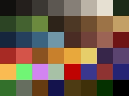

# Especificación de arte — Cuarentena

Cómo dibujar para que el arte de los tres encaje entre sí y el juego lo tome
solo. Si algo se dibuja con otra medida o con otro nombre, después no calza.

> **Cómo funciona:** dejás caer el PNG en la carpeta que corresponde y **el
> juego lo usa solo**. No hay que tocar código, ni avisarle a nadie, ni abrir
> ninguna escena. Mientras el archivo no esté, el juego sigue mostrando la
> forma de color de siempre y no se rompe nada.

---

## ⚠ Lo primero: **PNG, nunca JPG**

Esto es lo que más caro sale descubrir tarde, así que va antes que todo lo demás.

**El JPG arruina el pixel art, por dos motivos:**

1. **No tiene transparencia.** Un personaje en JPG viene con un fondo sólido
   pegado, y en el juego se ve un cuadrado de color alrededor del sprite. Los
   personajes y los objetos **necesitan** fondo transparente.
2. **Es compresión con pérdida.** El JPG inventa colores intermedios y deja
   halos sucios alrededor de cada borde. Un dibujo de 32 colores se convierte en
   uno de miles y pierde el filo del píxel, que es justamente lo único que
   define al pixel art.

**Y no se puede deshacer.** Convertir un JPG a PNG **no recupera** lo que se
perdió: solo guarda el desastre en otro formato.

**Entonces:**
- En Aseprite: **File → Export**, formato **PNG**. No "Save As JPG", no captura
  de pantalla, no mandarlo por WhatsApp (WhatsApp lo recomprime a JPG).
- Para pasarse archivos entre ustedes: **por el repo**, o comprimidos en un ZIP.
  Cualquier app de mensajería que "optimiza" imágenes los va a arruinar.
- **Guarden siempre el `.aseprite` original.** Es lo único que permite volver
  atrás y corregir.

Si algún original ya se perdió y solo queda el JPG, hay una herramienta de
rescate: ver el final de este documento.

---

## Tamaños

| Elemento | Tamaño | Notas |
|---|---|---|
| **Tile del mundo** | **16 × 16** | Pasto, camino, agua, árbol, pared, piso, roca, veta, puerta. |
| **Personajes** | **32 × 32** | Jugador, zombi, lobo, animal. Ocupan ~2×2 tiles. |
| **Objetos sueltos** | **16 × 16** | Comida, herramientas, ítems del suelo. |
| **Props grandes** | múltiplos de 16 | Ej. 32×32 o 32×48. Siempre múltiplo del tile. |

**Un solo "tamaño de píxel".** Al dibujar un personaje de 32×32, cada píxel
tiene que verse igual de grande que en un tile de 16×16. O sea: el personaje
ocupa 32 píxeles **de verdad**, no es un dibujo de 16×16 agrandado.

**Sin suavizado.** Nada de anti-aliasing, nada de degradados suaves, nada de
pincel con opacidad. Lápiz duro, un píxel a la vez.

---

## Dónde apoya el personaje (el detalle que arruina todo si se define tarde)

Un personaje de 32×32 se dibuja **centrado en horizontal** y con **los pies en
la fila 24** (contando desde arriba, empezando en 0).

```
      fila 0  ┌────────────────┐
              │                │   ← el cuerpo va acá arriba:
              │      ▄▄▄▄      │     24 píxeles de alto
              │     ▐████▌     │
              │      ▐██▌      │
     fila 24  ├──────▀▀▀▀──────┤   ← LOS PIES VAN ACÁ
              │                │   ← los últimos 8 píxeles quedan
     fila 31  └────────────────┘     libres (sombra, o vacío)
                     ↑
              centrado en horizontal (columna 16)
```

**Por qué importa:** el juego apoya esa fila 24 sobre la celda donde está
parado el personaje. Si dibujás los pies más abajo o más arriba, el personaje
va a verse flotando o hundido en el piso, y hay que rehacer **todos** los
dibujos para corregirlo. Es un minuto ahora y una tarde después.

---

## Las 4 direcciones

Cada personaje mira a **4 lados**, pero se dibujan **3**: la izquierda es la
derecha espejada, eso lo hace el juego solo.

| Archivo | Qué se ve |
|---|---|
| `abajo.png` | de frente, mirando a la cámara |
| `arriba.png` | de espaldas |
| `lado.png` | de perfil, **mirando a la derecha** |

Ojo con `lado.png`: **siempre mirando a la derecha**. Si lo dibujás mirando a la
izquierda, en el juego va a mirar al revés.

---

## Nombres de archivo

Todo en minúscula, sin acentos, sin espacios.

```
game/assets/
  tiles/
    pasto.png   camino.png   agua.png    arbol.png   pared.png
    piso.png    roca.png     veta.png    puerta.png
  sprites/
    jugador/    abajo.png  arriba.png  lado.png
    zombi/      abajo.png  arriba.png  lado.png
    lobo/       abajo.png  arriba.png  lado.png
    animal/     abajo.png  arriba.png  lado.png
```

### Para animar

Mismo nombre con `_1`, `_2`, `_3`… y listo. **No hay que tocar nada más.**

```
sprites/jugador/abajo_1.png
sprites/jugador/abajo_2.png
sprites/jugador/abajo_3.png
```

- Si están los numerados, el juego los usa como animación.
- Si está solo `abajo.png`, lo usa quieto.
- Se pueden mezclar: el jugador animado y el lobo quieto, sin problema.
- Los números tienen que ir **seguidos**. Si hay `_1` y `_3` pero falta `_2`, la
  animación se corta en el 1 — el verificador avisa de eso.

---

## Paleta

**Todos dibujan con la misma paleta.** Sin esto, tres personas sacan tres juegos
distintos y unificarlo después no es retocar: es rehacer.

**Cómo cargarla en Aseprite:** abrir el juego, ir al panel de la paleta (abajo a
la izquierda), tocar el menú de las tres rayitas → **Load Palette** → elegir
`game/assets/paleta.gpl`.

En LibreSprite y GIMP es igual: los dos leen `.gpl`.



| Color | Hex | | Color | Hex |
|---|---|---|---|---|
| Negro | `#12100f` | | Agua profunda | `#16273d` |
| Sombra | `#241f1d` | | Agua | `#24405c` |
| Gris oscuro | `#3b3733` | | Agua clara | `#3a6480` |
| Gris | `#5c5751` | | Cielo | `#6f97a8` |
| Gris claro | `#857f77` | | Ladrillo oscuro | `#4a2c25` |
| Hueso | `#bab3a6` | | Ladrillo | `#70423a` |
| Blanco sucio | `#e6e0d2` | | Ladrillo claro | `#9c6455` |
| Verde muy oscuro | `#1b2b18` | | Sangre | `#6e1414` |
| Verde oscuro | `#2c4423` | | Rojo | `#a82a24` |
| Verde | `#44622f` | | Rojo claro | `#d4544a` |
| Verde claro | `#6b8a3e` | | Oxido | `#8a5220` |
| Tierra oscura | `#2e2318` | | Naranja | `#c8802c` |
| Tierra | `#4d3826` | | Fuego | `#e8a83c` |
| Madera | `#6f4f2f` | | Amarillo | `#e6cf6a` |
| Madera clara | `#9c7346` | | Violeta oscuro | `#38264a` |
| Arena | `#c2a066` | | Violeta | `#5c4470` |

Si de verdad hace falta un color que no está, **avisen antes de usarlo** y lo
agregamos a la paleta para todos. El verificador avisa cuando aparece un color
de afuera, así no se cuela sin que nadie se entere.

---

## El primer lote: 21 archivos

Para repartirse entre los tres. Tachar acá a medida que salen.

**Tiles del mundo** (16×16) — es lo que ocupa el 90% de la pantalla, así que es
lo que más cambia la cara del juego:

- [ ] `tiles/pasto.png`
- [ ] `tiles/camino.png`
- [ ] `tiles/agua.png`
- [ ] `tiles/arbol.png`
- [ ] `tiles/pared.png` — ladrillo
- [ ] `tiles/piso.png` — madera, el interior de las casas
- [ ] `tiles/roca.png`
- [ ] `tiles/veta.png` — roca con mineral
- [ ] `tiles/puerta.png`

**Personajes** (32×32, 3 direcciones cada uno):

- [ ] `sprites/jugador/` — abajo, arriba, lado
- [ ] `sprites/zombi/` — abajo, arriba, lado
- [ ] `sprites/lobo/` — abajo, arriba, lado
- [ ] `sprites/animal/` — abajo, arriba, lado

**Las variantes de zombi** (normal, corredor, resistente) por defecto usan el
mismo dibujo de `sprites/zombi/` y se distinguen por un tinte de color, así que
no hace falta un set por variante. Pero si alguna variante quiere su **propio**
dibujo (como el zombi grande/resistente), va en su propia carpeta con el mismo
formato de siempre — `sprites/zombi_resistente/` (abajo, arriba, lado, 32×32,
transparente) — y **no se tiñe**: se distingue por su propio diseño. Mientras
esa carpeta no tenga PNG, esa variante sigue mostrando el dibujo base con el
tinte, así que se puede ir agregando art de a una variante sin romper nada.
Para agregar otra variante con dibujo propio, sumarla a `SPRITE_OVERRIDE` en
`scripts/systems/horde_spawner.gd`.

- [ ] `sprites/zombi_resistente/` — abajo, arriba, lado (el zombi grande)

**Los tiles no llevan transparencia** (son cuadrados llenos). Los **personajes
sí**: fondo transparente, siempre.

---

## Antes de subir

```bash
python3 tools/verificadores/check_arte.py
```

Revisa cada archivo y avisa si algo está mal **antes** de que rompa el juego:
que sea PNG de verdad, que los personajes tengan transparencia, que las medidas
den, que los cuadros de animación no tengan saltos, y que los colores estén en
la paleta. Además muestra **qué falta todavía**, que es la forma más simple de
ver cómo viene el arte.

---

## Rescate: si solo queda el JPG

Si de algún dibujo se perdió el original y solo está el JPG, hay un script para
sacarlo del paso:

1. Abrir el proyecto en Godot.
2. Poner los JPG en `game/assets/importar/`.
3. Abrir `game/tools/importar_arte.gd` en el editor y apretar **File → Run**.

Convierte a PNG, saca el fondo a transparencia y avisa de las medidas que no
dan. **Pero el dibujo ya perdió calidad y eso no se recupera**: sirve para
seguir trabajando, no para quedárselo. Cuando puedan, rehacer ese sprite desde
cero con la paleta.

---

## Estado actual

Todo lo que no tenga su PNG se dibuja como **forma de color** (placeholder), y
el juego funciona igual. El arte real reemplaza esos placeholders de a uno, sin
tocar código y sin romper nada en el medio.
